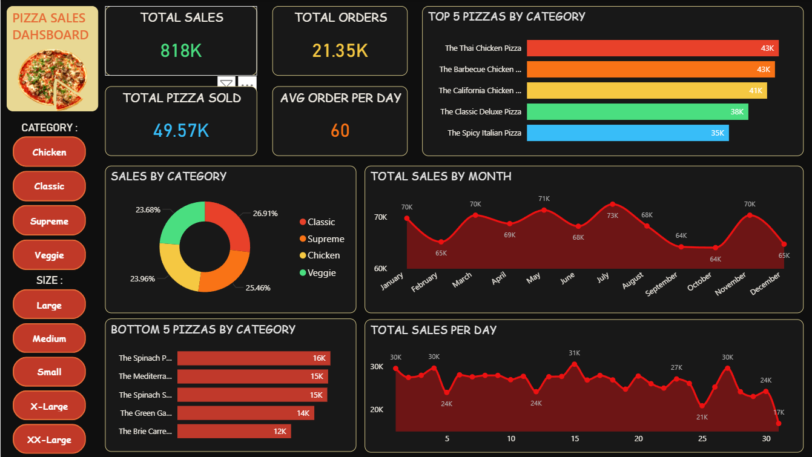

# 🍕 Pizza Sales Analysis (End-to-End Data Project)

<div align="center">
  
</div>

---

## 📊 Project Overview
This project provides a deep-dive analysis into the sales performance of a pizza store for the entire year of 2015. Using **PostgreSQL** for data processing and **Power BI** for interactive visualization, I transformed **21,350+ raw order records** into actionable business insights.

### 🎯 Key Objectives:
* Identify sales trends (Daily & Monthly).
* Analyze best and worst-selling pizza categories and sizes.
* Calculate critical KPIs: Total Revenue, Average Order Value, and Total Pizzas Sold.
* Provide recommendations for inventory and staffing optimization.

---

## 🛠️ Tech Stack & Skills
* **Database:** PostgreSQL (KPI Extraction & Data Cleaning)
* **Visualization:** Power BI (Interactive Dashboarding)
* **Language:** SQL, DAX (Data Analysis Expressions)
* **Tools:** Power Query (ETL), Microsoft Excel

---

## 📈 Dashboard Preview


> *Note: Ensure the image file `pizza_sales_dasboard_image.PNG` is uploaded to your GitHub repository folder.*

---

## 🚀 Key Insights (FY 2015)
| Metric | Value |
|---|---|
| 💰 Total Revenue | $817.86K |
| 📦 Total Orders | 21,350 |
| 🧾 Avg Order Value | $38.31 |
| 📅 Busiest Day | Friday (Peak in evenings) |
| ⏰ Peak Hours | 12:00 PM – 1:00 PM & 5:00 PM – 7:00 PM |
| 🍕 Top Category | Classic Pizzas |
| 📏 Top Size | Large (L) — ~45% of total revenue |

---

## 💻 Sample SQL Analysis
I used **PostgreSQL** to extract meaningful KPIs from the raw data. Below are the key queries:

### 1. Daily Trend for Total Orders
```sql
SELECT 
    TO_CHAR(date::Date, 'Day') AS Day_Name, 
    COUNT(DISTINCT order_id) AS Total_Orders
FROM orders 
GROUP BY Day_Name 
ORDER BY Total_Orders DESC;
```

### 2. Monthly Revenue Trend
```sql
SELECT 
    EXTRACT(MONTH FROM o.date) AS Month, 
    SUM(od.quantity * p.price) AS Monthly_Revenue
FROM orders o 
JOIN order_detail od ON o.order_id = od.order_id
JOIN pizza p ON p.pizza_id = od.pizza_id
GROUP BY Month
ORDER BY Month ASC;
```

### 3. Bottom 5 Worst Selling Pizzas (By Quantity)
```sql
SELECT 
    pt.name, 
    SUM(od.quantity) AS Total_Quantity_Sold
FROM order_detail od
JOIN pizza p ON od.pizza_id = p.pizza_id
JOIN pizza_types pt ON pt.pizza_type_id = p.pizza_type_id
GROUP BY pt.name 
ORDER BY Total_Quantity_Sold ASC
LIMIT 5;
```

---

## 📂 Project Structure
```text
├── 📂 data/                    # CSV Data Files (Orders, Pizzas, etc.)
├── 📄 pizza_sales_project_script.sql  # PostgreSQL KPI Queries
├── 📊 pizza_sales_dashboard.pbix      # Power BI Dashboard File
├── 📝 pizza_sales_report.pdf          # Detailed Analysis Report
└── 📝 README.md                       # Project Documentation
---

## 💡 Recommendations
* **Marketing:** Launch "Friday Night Deals" to capitalize on the highest traffic day.
* **Staffing:** Increase staff during the 12–1 PM and 5–7 PM windows to reduce wait times during peak hours.
* **Inventory:** Focus on the `Classic` category and `Large` size ingredients as they drive maximum volume.
* **Menu Optimization:** Review the bottom 5 selling pizzas (like the *Brie Carre Pizza*) for potential removal or rebranding.

---

## 👤 Author
**Anuj Kumar Tiwari** — Aspiring Data Analyst

<div align="center">

[](https://linkedin.com/in/anuj-kumar-tiwari-107704208)
[](mailto:anuujji@gmail.com)
[](https://github.com/Anuj-Kumar-Tiwari)

</div>

---

<div align="center">
  ⭐ <b>If you like this project, feel free to star the repository!</b>
</div>


